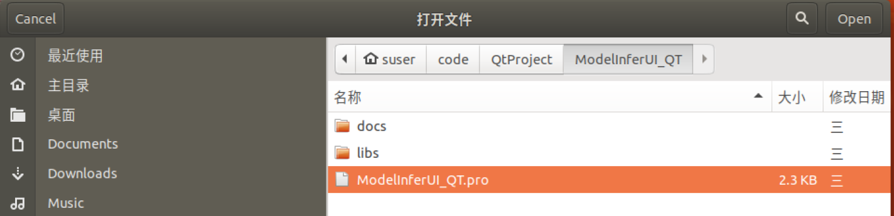
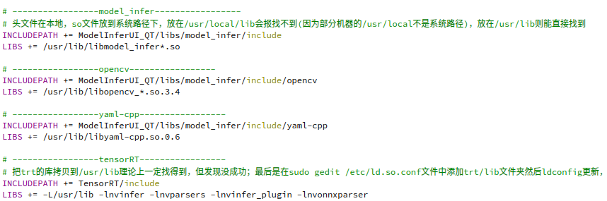
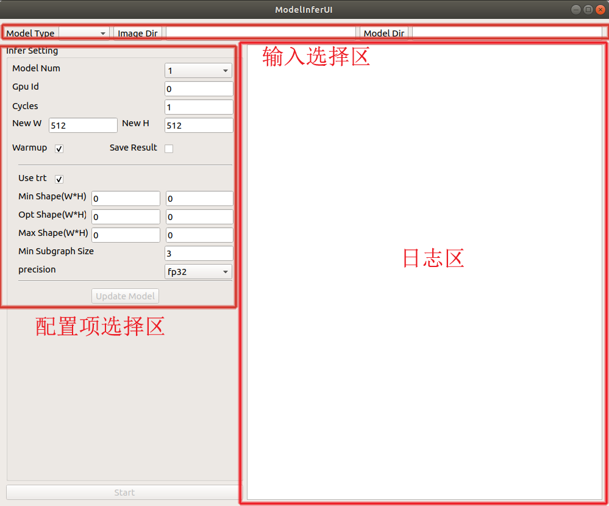
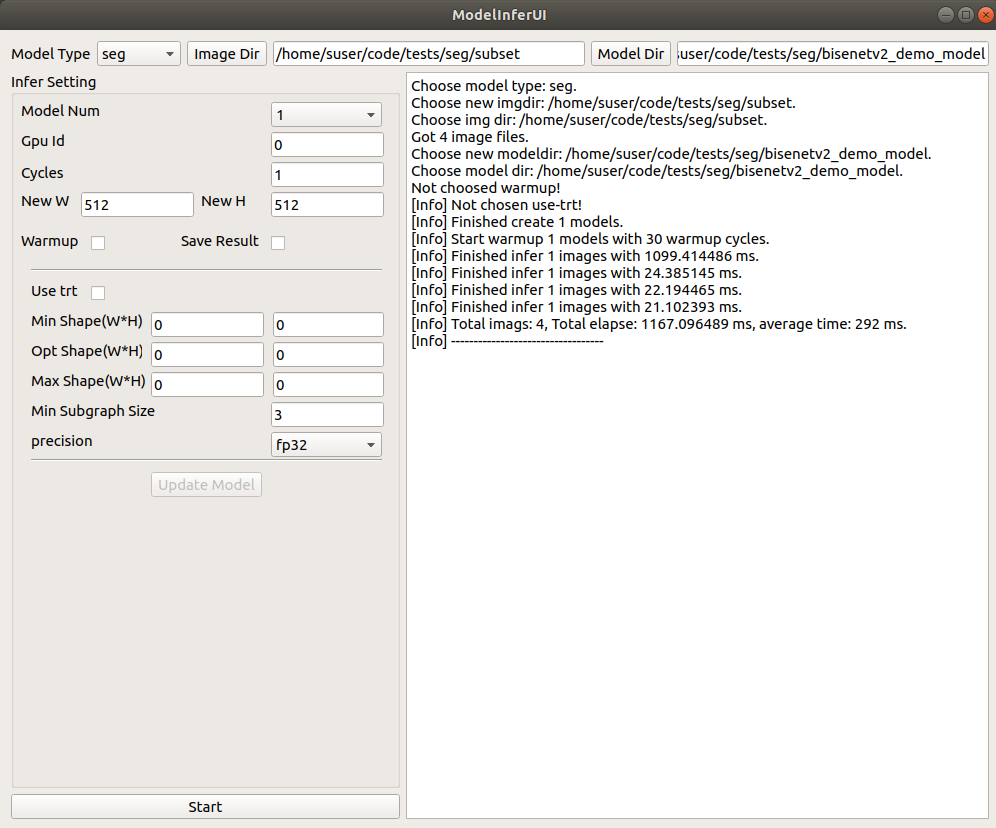

# PaddleCV Qt客户端-基于Linux x86平台的部署

## 1 环境准备

在执行以下安装步骤前，请确保您具有**操作系统的root权限**，并已经在系统中安装了如下软件包和依赖库：

> CUDA>=10.1
>
> cuDNN>=7.6
>
> GCC>=5.4.0
>
> CMake>=3.5.1
>
> Qt>=5.9.9
>
> TensorRT==7.2.3

本教程将以Debian系的Ubuntu 18.04系统为例介绍软件的安装步骤，如果您使用的是其它Linux发行版，请在执行apt相关命令时换用配套的软件包管理器。

在接下来的步骤中，约定本项目中`ModelInferUI_QT`目录所在的路径为PROJECT_PATH（请将后续步骤中出现的PROJECT_PATH替换为实际路径），TensorRT的安装路径为TENSORRT_PATH。

## 2 编译Paddle Inference

请首先检查[此页面](https://paddleinference.paddlepaddle.org.cn/v2.1/user_guides/download_lib.html)是否包含您的环境配置所对应的已编译好的PaddlePaddle C++预测库（例如，CUDA10.2、cuDNN8.1、GCC8.2对应的版本为manylinux_cuda10.2_cudnn8.1_avx_mkl_trt7_gcc8.2）。如果网页提供了现成的`paddle_inference.tgz`文件，将其下载并解压到本地，解压后的路径即为Paddle Inference所在路径（记为PADDLEINFER_PATH）；否则，您需要根据[PaddlePaddle源码编译指南](https://www.paddlepaddle.org.cn/documentation/docs/zh/install/compile/linux-compile.html)在本地执行编译和链接等操作，在这种情况下，PADDLEINFER_PATH为Paddle项目构建目录下的`paddle_inference_install_dir`子目录的路径。

注意，需要安装的Paddle Inference版本为2.3。此外，在编译PaddlePaddle时，请为cmake指定`-DWITH_TENSORRT`选项为`ON`，并设置环境变量`TENSORRT_ROOT`为步骤1中的TENSORRT_PATH，以确保预测库对TensorRT的支持。

## 3 构建动态库

根据[PaddleX编译指南](https://github.com/PaddlePaddle/PaddleX/blob/develop/deploy/cpp/docs/compile/paddle/linux.md#step-3-%E4%BF%AE%E6%94%B9%E7%BC%96%E8%AF%91%E5%8F%82%E6%95%B0)修改`PROJECT_PATH/libs/PaddleX-release-2.0.0/deploy/cpp/scripts/build.sh`脚本中的参数，请指定`WITH_GPU`为`ON`、`PADDLE_DIR`为步骤2中的PADDLEINFER_PATH，`WITH_PADDLE_TENSORRT`为`ON`、`TENSORRT_DIR`为步骤1中的TENSORRT_PATH。

参数修改完成后，执行如下指令：

```bash
cd PROJECT_PATH/libs/PaddleX-release-2.0.0/deploy/cpp
sudo bash scripts/build.sh
```

若命令执行过程中没有提示错误，则说明构建成功。执行如下指令创建一些拷贝和软链接：

```bash
sudo ln -s PADDLEINFER_PATH/
sudo bash scripts/mklinks.sh PROJECT_PATH
```

最终生成的动态库以及对应的头文件等可在`PROJECT_PATH/libs/model_infer`目录找到，执行如下指令查看：

```bash
ls PROJECT_PATH/libs/model_infer/include
ls PROJECT_PATH/libs/model_infer/lib
```

## 4 构建并运行Qt项目

如果您尚未安装Qt Creator，请首先执行如下指令：

```bash 
sudo apt install qt5-default qtcreator
```

安装完毕后，启动Qt Creator软件，选中`ModelInferUI_QT.pro`文件并打开：



在编辑器中打开`ModelInferUI_QT.pro`文件，下拉到底部，修改以下部分：



将路径中的`ModelInferUI_QT`替换为PROJECT_PATH，`TensorRT`替换为TENSORRT_PATH。

最后，在菜单栏中选择“构建”->“运行”，执行程序。程序构建完毕后，您将看到如下界面：



如图所示，界面最上方为输入选择区，左侧为配置项选择区，右侧为日志区。

## 5 软件使用

### 5.1 模型与数据准备

在使用客户端之前，您需要准备模型与数据。使用PaddleSeg、PaddleClas、PaddleDetection或PaddleX执行模型导出，具体步骤请参考相关教程：

+ [PaddleSeg模型导出教程](https://github.com/PaddlePaddle/PaddleX/blob/develop/deploy/cpp/docs/models/paddleseg.md)
+ [PaddleClas模型导出教程](https://github.com/PaddlePaddle/PaddleX/blob/develop/deploy/cpp/docs/models/paddleclas.md)
+ [PaddleDetection模型导出教程](https://github.com/PaddlePaddle/PaddleX/blob/develop/deploy/cpp/docs/models/paddledetection.md)
+ [PaddleX模型导出教程](https://github.com/PaddlePaddle/PaddleX/blob/develop/docs/apis/export_model.md)

输入的数据需以OpenCV的`imread()`函数能够识别的格式存储，所有图片直接包含在同一目录中（即，无嵌套层级目录）。

### 5.2 输入与配置选择

#### 5.2.1 输入选择

首先选定模型的类型，即输入选择区的`Model Type`。一共有5种模型类型：`clas`、`seg`、`det`、`mask`和`paddlex`，其中`clas`和`seg`分别为PaddleClas和PaddleSeg导出的模型类型，`det`和`mask`分别为PaddleDetection导出的非mask检测模型（如YOLO）和mask检测模型（如Mask R-CNN）类型，`paddlex`为PaddleX导出的模型类型。

接着，选择数据和模型存储的位置，分别对应输入选择区的`Image Dir`和`Model Dir`。在选择要输入的数据或模型后，日志区均会给出相应的提示信息。

#### 5.2.2 基本配置

配置项选择区的`Model Num`选项指定构建的模型个数，构建的模型具有相同的规格，可以并行执行推理。`Gpu Id`指定要使用的GPU的编号。`Cycles`指定对所有图像执行推理的轮数。`New W`和`New H`指定输入模型的图像宽高，需与模型要求的输入尺寸相匹配。`Warmup`指定是否启用模型预热，如果勾选此项，模型将执行30轮预热。`use_trt`指定是否使用TensorRT进行加速。`use_trt`选项与`Warmup`选项默认为勾选状态。`Save Result`选项指定是否存储预测结果，但需要注意的是，对于Linux平台客户端而言，存储结果的功能暂时不可用，因此即使勾选`Save Result`选项也无法存储模型预测结果。

#### 5.2.3 TensorRT优化配置

客户端提供了TensorRT优化的功能。根据优化目标，您可以在配置项选择区调整TensorRT相关配置。`Min Shape`、`Opt Shape`和`Max Shape`可为TensorRT自动确定最优的输入尺寸提供辅助信息，这三个选项中每个选项包含两个文本框，请在左边的文本框中输入宽（W），右边的文本框中输入高（H）。关于TensorRT优化网络输入尺寸方面的内容可参考[官方文档](https://docs.nvidia.com/deeplearning/tensorrt/api/python_api/infer/Core/OptimizationProfile.html)。`Min Subgraph Size`为最小子图尺寸，设置值越大则TensorRT的优化程度越低。`Precision`为精度类型，可选项有`fp32`、`fp16`和`int8`。以上配置项均只在勾选`use_trt`选项后生效。

注：目前并非所有模型都支持TensorRT优化。若勾选`use_trt`选项后出现程序报错退出的情况，请考虑使用Paddle Inference原生引擎进行推理。

### 5.3 模型构建与推理

配置完成后，点击`Update Model`按钮进行模型构建，此过程一般需要数秒至十数秒不等的等待时间。模型构建完毕后，日志区输出`[Info] Finished create 1 models.`，而界面下方的`Start`按钮变为可用状态。

点击`Start`按钮执行模型推理。推理过程中，日志区将给出包含每幅图像推理耗时的提示信息；推理完成后，给出总耗时、平均耗时等信息。如下图所示：



## 6 常见问题

+ 问：步骤3中提示警告`libpng12.so.0, needed by ../../deps/opencv3.4.6gcc4.8ffmpeg/lib/libopencv_imgcodecs.so.3.4.6, not found`。

  - 答：执行如下指令：

    ```bash
    sudo add-apt-repository ppa:linuxuprising/libpng12
    sudo apt update
    sudo apt install libpng12-0
    ```

+ 问：步骤4中提示找不到`libdnnl.so.2`。
  
- 答：在`ModelInferUI_QT.pro`文件中添加一行：`LIBS += /usr/lib/libdnnl.so.2`，然后在命令行中执行`sudo ln -s PADDLEINFER_PATH/third_party/install/mkldnn/lib/libdnnl.so.2 /usr/lib/`。
  
+ 问：步骤3提示`/usr/bin/ld: 找不到 -lz`。

  - 答：执行如下指令：

    ```bash
    sudo apt install zlib1g-dev
    ```

+ 问：未找到`rename`命令。

  - 答：执行如下指令：

    ```bash
    sudo apt install rename
    ```
